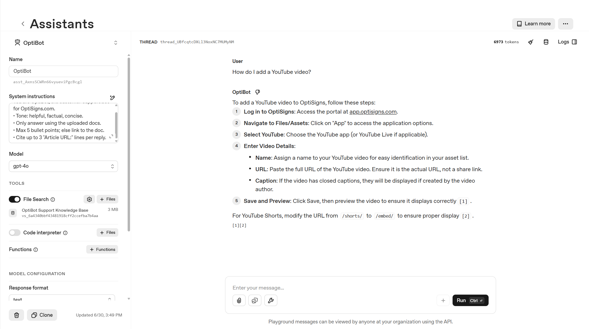

# Mini-Chatbot

A one-shot ingestion pipeline that scrapes public OptiSigns support articles,
converts them to clean Markdown, and synchronizes only changed files to an
OpenAI Vector Store.

## Setup

Requirements: Python 3.13+, an OpenAI Project API key, and optionally Docker
Desktop for container testing.

Open PowerShell and run each group in order:

```powershell
# 1. Download the repository and enter its directory.
git clone https://github.com/TamNgx179/Mini-Chatbot.git
Set-Location Mini-Chatbot

# 2. Create and activate an isolated Python environment.
python -m venv .venv
.\.venv\Scripts\Activate.ps1

# 3. Install the required Python packages.
python -m pip install -r requirements.txt

# 4. Create a local configuration file from the safe template.
Copy-Item .env.example .env
notepad .env
```

Replace both placeholders in `.env`:

```dotenv
OPENAI_API_KEY=your_project_api_key
OPENAI_VECTOR_STORE_ID=your_vector_store_id
```

The real `.env` is Git-ignored and must never be committed.

## Run locally

```powershell
# Safe check: scrape all articles and calculate the delta without remote writes.
python main.py --all --dry-run

# Real daily job: scrape, upload added/updated files, and remove stale files.
python main.py --all

# Scrape Markdown only; do not connect to OpenAI.
python main.py --all --scrape-only

# Run the automated test suite.
$env:PYTHONPATH="src"
python -m unittest discover -s tests -v
```

The current corpus contains 402 articles. Static chunking uses 1,200 tokens
with 200-token overlap (approximately 700 chunks). Stable Article IDs and
SHA-256 hashes classify documents as `added`, `updated`, `skipped`, or
`removed`, so only the delta is uploaded.

## Run with Docker

Start Docker Desktop first, then run:

```powershell
# Build a reproducible image from the Dockerfile.
docker build -t optibot-daily-sync .

# Run one complete sync inside a temporary container, then remove it.
docker run --rm --env-file .env optibot-daily-sync --all
```

Docker Desktop is needed only for local testing. GitHub Actions builds and runs
the same container independently in the cloud.

## Daily job logs

GitHub Actions runs daily at 02:17 `Asia/Ho_Chi_Minh` and publishes the console
log plus JSON report as a downloadable artifact.

- [Workflow and run history](https://github.com/TamNgx179/Mini-Chatbot/actions/workflows/daily-sync.yml)
- [Verified successful run](https://github.com/TamNgx179/Mini-Chatbot/actions/runs/28450621161)

## Assistant result

The Assistant answers the required sample question using File Search citations
from the uploaded OptiSigns Markdown article:


